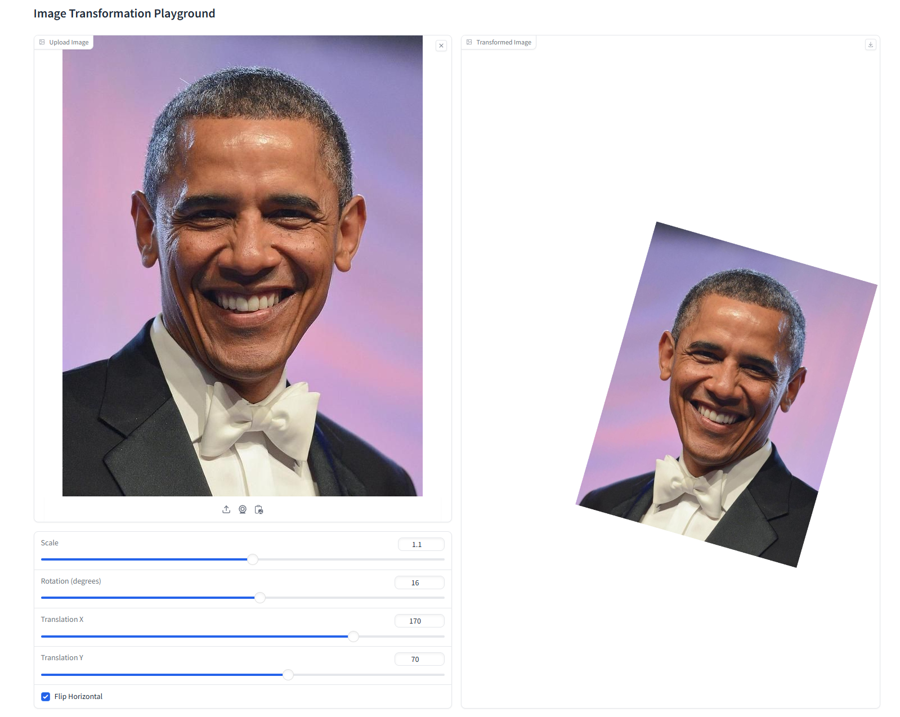
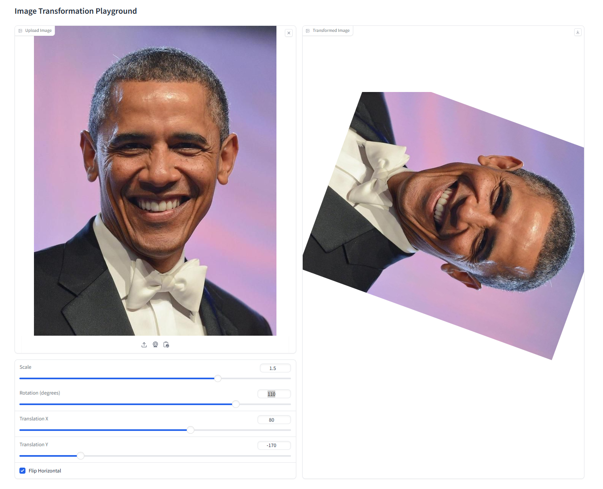
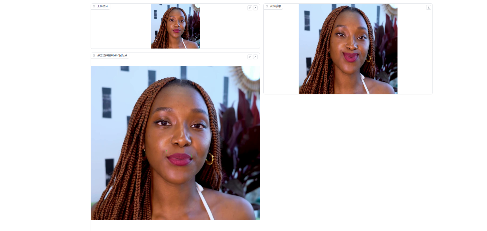

## Implementation of Image Geometric Transformation

This repository is JunyiWang's implementation of Assignment_01 of DIP. 


## Requirements

To install requirements:

```setup
python -m pip install -r requirements.txt
```


## Running

To run basic transformation, run:

```basic
python run_global_transform.py
```

To run point guided transformation, run:

```point
python run_point_transform.py
```

## Results
### Basic Transformation



### Point Guided Deformation:


