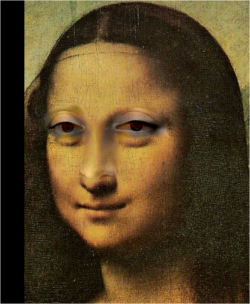
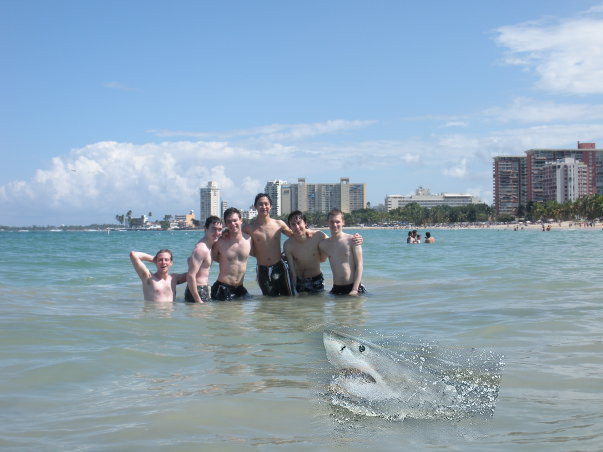
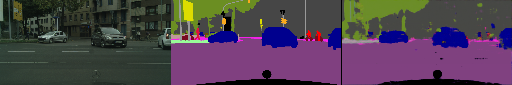

This repository is JunyiWang's implementation of Assignment_02 of DIP. 
### Requirements:

To install requirements:

```setup
python -m pip install -r requirements.txt
```
You should also setup PyTorch according to your cuda version

### 1. Implement Poisson Image Editing with PyTorch.
### The results are as followed




### 2. Pix2Pix implementation.
## Datasets

To have the datasets:
I use the [cityscapes-dataset](https://www.cityscapes-dataset.com/) as my dataset
about 2700 images for train and 150 images for validation

## Training

To train the model(s) in the paper, run this command:

```train
python Pix2Pix/train.py 
```

## Results

Due to the large number of segmentation categories in the dataset and the simplicity of the model used, the results are not very satisfactory.

### [The result predicted by the training set]



### [The result predicted by the validation set]


