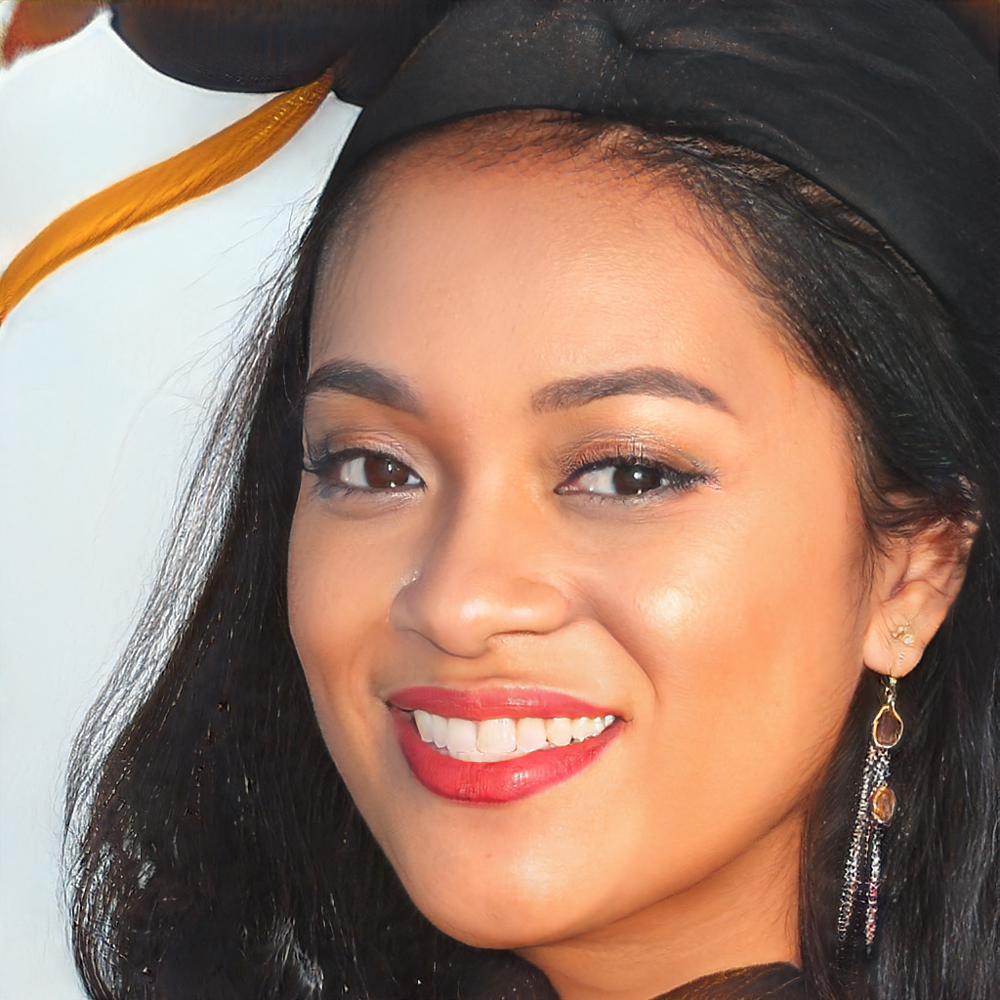

# Assignment 3 - Play with GANs

This repository is JunyiWang's implementation of Assignment_03 of DIP. 

### Task 1
## Requirements

To install requirements:

You can use the same file as the requirements.txt of Assignment_02 of DIP to install the requirements.

```bash
python train.py
```
## Results 
After training for 200 epochs, the results of train sets are as follows:


the results of validation sets are as follows:


### Task 2
## Requirements
I use the [DragGAN](https://github.com/OpenGVLab/DragGAN) to implement the point guided transformation.
```bash
git clone https://github.com/Zeqiang-Lai/DragGAN.git
cd DragGAN
conda create -n draggan python=3.7
conda activate draggan
pip install -r requirements.txt
```
Due to the bad connection error of gradio, you may need to install pydantic==1.10.11 to solve this problem.
```bash
pip install pydantic==1.10.11
```
For use the face landmarks, you need to install face-alignment.
```bash
git clone https://github.com/1adrianb/face-alignment
cd face-alignment
pip install -r requirements.txt
python setup.py install
```

## Running
run:
```bash
python gradio_app.py
```

## Results
Reference image:

Generated video:
<video width="800" controls>
  <source src="DragGAN/draggan_tmp/video.mp4" type="video/mp4">
</video>


